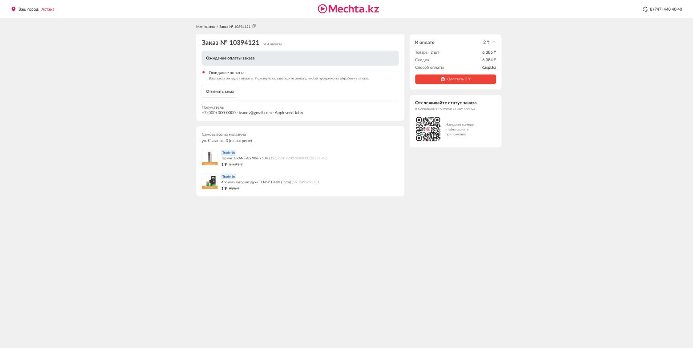

# BUG-002: Название уценённого товара в «Деталях заказа» не кликабельно — нет перехода на страницу товара

**Severity:** Medium
**Статус:** Подтверждён
**Окружение:** pp.yc.mechta.kz (preprod), реальный заказ № 10394121 тестового аккаунта
**Дата:** 2026-08-06

## Затрагивает кейс теста-плана

TC-041 (Лист 4 "Детали заказа").

## Описание

По тест-плану: на странице «Детали заказа» клик по названию уценённого товара
должен открывать страницу этого конкретного уценённого экземпляра (по его
slug).

По факту: название товара — это простой `
` без какой-либо ссылки. Проверка
полного списка `<a>` на странице (`document.querySelectorAll('a')`) показала
всего 4 ссылки на всей странице — логотип, «Мои заказы», «Главная»,
«Избранное» — ни одна не ведёт на карточку товара. Обход DOM вверх от
названия товара на 6 уровней тоже не находит `<a>`. Ни название, ни картинка
товара не кликабельны.

## Шаги воспроизведения

1. Авторизоваться (`cy.login()` / тестовый номер 0000000000).
2. Открыть `/cabinet/orders/` → любой заказ с уценённой позицией (например,
   № 10394121 — содержит 2 уценённые позиции с SN в скобках).
3. Попробовать кликнуть на название или картинку товара.

## Ожидаемый результат

Клик открывает страницу конкретного уценённого экземпляра по его slug.

## Фактический результат

Ничего не происходит — элемент не является ссылкой, обработчика клика нет.

## Скриншот

